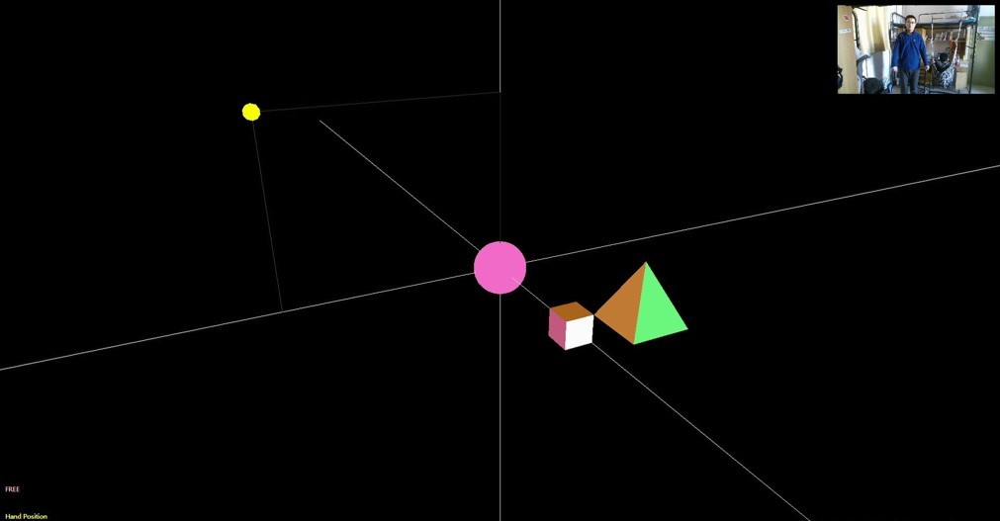
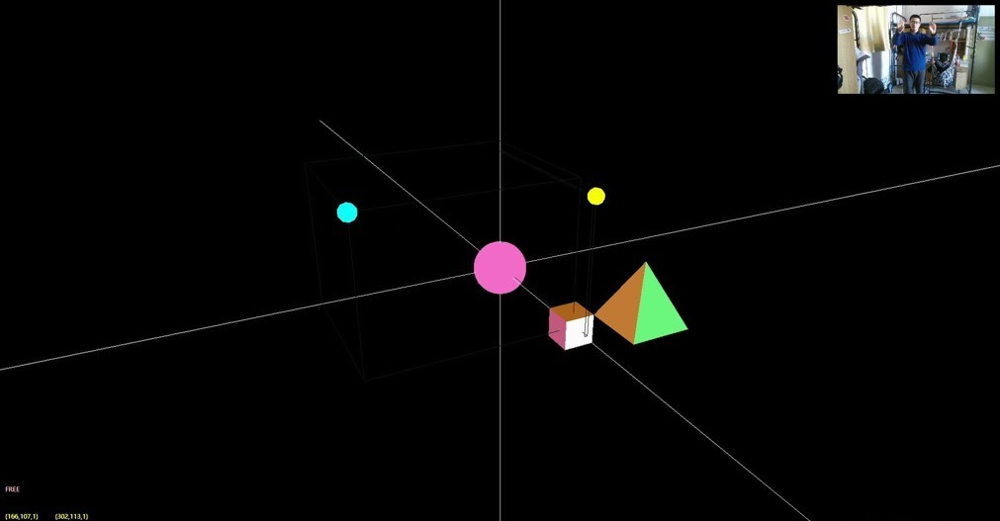
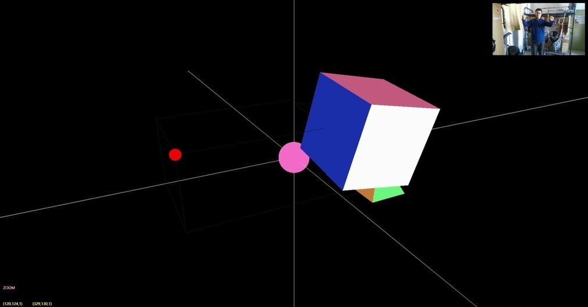
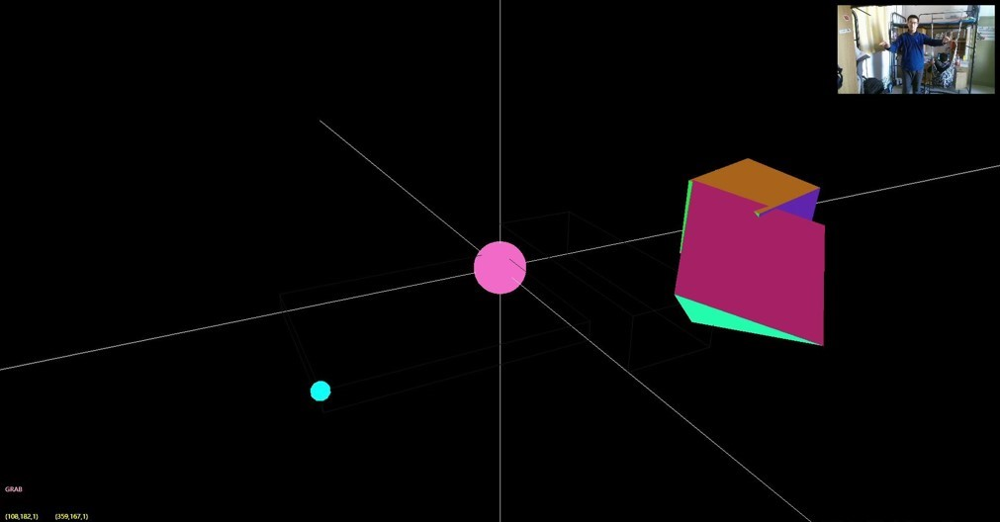

# Kinect-Control-with-OpenGL-demo
move, zoom and rotate by natural control with hands. (C#, VS2013 project, Kinect2.0, SharpGL)

You can get more details about implements on my blog [*tanknet*](http://tanknet.cn/2016/12/02/kinect-opengl-jarvis/#more)

# Usage
You need:
- C# WPF environment
- SharpGL (OpenGL for C#)
- Kinect for windows 2.0

and then, stand in the range of kinect and wait for detection.

# Screenshoots

